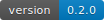
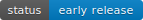
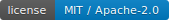
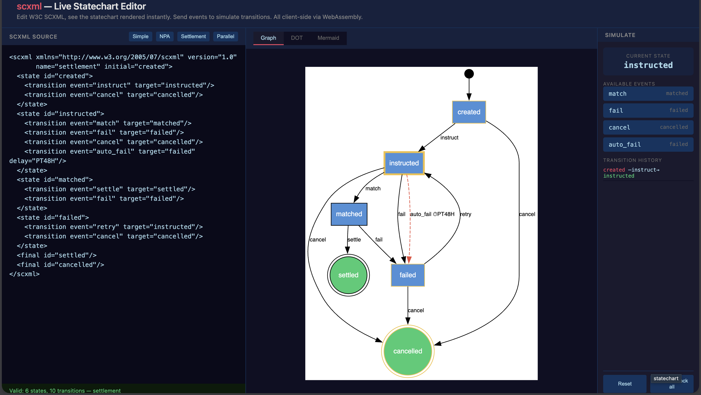

# scxml — W3C SCXML statechart library for Rust

[](https://github.com/GnomesOfZurich/scxml/actions/workflows/ci.yml)




[](https://doc.rust-lang.org/cargo/reference/manifest.html#the-badges-section)

[crates.io](https://crates.io/crates/scxml) · [docs.rs](https://docs.rs/scxml) · [GitHub](https://github.com/GnomesOfZurich/scxml) · [Live Demo](https://gnomesofzurich.github.io/scxml/)

Every non-trivial system has state machines. Approval workflows, settlement protocols, document lifecycles, game AI, embedded controllers; they are all state machines, whether their authors admit it or not. Most teams reinvent them from scratch using ad-hoc enums and match statements, then discover the hard way that they need hierarchy, parallel regions, history states, and formal validation. David Harel solved this in 1987 with [statecharts](https://doi.org/10.1016/0167-6423(87)90035-9). The W3C standardised the serialization format as [SCXML](https://www.w3.org/TR/scxml/) in 2015.

The Rust ecosystem has several state-machine crates aimed at code-defined FSMs (`statig`, `rust-fsm`, `finny`, `sm`), but support for **SCXML as an interchange format** for round-tripping XML, validating it, exporting to DOT/Mermaid, and simulating before deployment has been thin. This crate is for the use case where the state machine is a **document** that humans, tools, and other systems edit, review, and approve, not just a `match` block compiled into your binary.

**`scxml`** parses, validates, visualizes, and simulates W3C SCXML statecharts. It is not a runtime executor. Your compiled native types handle that. This crate is the document model: the layer that sits between human-readable definitions and machine-optimized execution, the same way a compiler frontend sits between source code and object code.

It is **framework-agnostic**: no Axum, Actix, Tokio, or async runtime in the dependency graph. Use it from a CLI, a web server, a desktop GUI, or a WebAssembly frontend. The same `Statechart` value flows through all of them.

**Organization:** Gnomes (GitHub: `GnomesOfZurich`)
**License:** MIT OR Apache-2.0
**Rust edition:** 2024, MSRV 1.87 (bumped only as a semver-breaking change)
**Specification:** [W3C SCXML](https://www.w3.org/TR/scxml/) (September 2015)

At a glance:

- `#![forbid(unsafe_code)]`: no `unsafe` anywhere in the crate
- Zero async runtime, zero web framework, zero platform syscalls in the default build
- Inert data model: guards are string names, never executed; `<script>` and `<invoke>` are stored verbatim, never evaluated
- 166 tests + 12 doc-tests, property-based tests via proptest, W3C conformance subset, security model documented
- WASM-compatible (entire crate compiles to `wasm32-unknown-unknown`)
- Optional rkyv zero-copy serialization for hot-path workflow lookups

---

## Installation

```bash
cargo add scxml
```

For browser/WebAssembly consumers, the default package on npm-compatible registries is `@gnomes/scxml`:

```bash
bun add @gnomes/scxml
yarn add @gnomes/scxml
npm install @gnomes/scxml
```

For the optional features:

```bash
cargo add scxml --features rkyv,xstate    # zero-copy + XState v5 round-trip
cargo add scxml --features wasm           # WebAssembly bindings
cargo add scxml --features wasm,xstate    # WebAssembly bindings plus XState interop
```

The default features (`xml`, `json`, `validate`, `export`) cover the common case of parsing SCXML, validating it, and exporting to DOT/Mermaid/XML/JSON. See the [full feature flag table](#feature-flags) below.

The published JavaScript package is a browser-first ESM build generated from the same Rust source tree with `wasm-pack`.

- `@gnomes/scxml` ships the core SCXML WebAssembly API: parse, validate, export, diff, flatten, and simulate.

---

## Why SCXML, and why now

XML is not the point. The statechart semantics are.

David Harel's [statecharts](https://doi.org/10.1016/0167-6423(87)90035-9) have been the formal foundation for complex state management since 1987. The W3C standardised the serialization as [SCXML](https://www.w3.org/TR/scxml/) in 2015 The same semantics underpin tools across every major language: hierarchical states, parallel regions, history, guards, event-driven transitions. What has been missing in Rust is strong support for SCXML as an interchange format rather than only as code compiled into a binary.

That is the use case this crate targets. It is for systems where the state machine is a document that needs to be parsed, validated, diffed, visualised,stored, reviewed, and approved outside the compiler. If your state machine needs to leave the binary and become part of an authoring or audit workflow, the XML and the in-memory `Statechart` model matter as first-class artifacts.

The intended architecture is deliberately two-speed. The cold path is authoring and administration: parse, validate, simulate, export, review, and diff. The hot path is your runtime: compile the validated statechart into native types and run those native types directly. The SCXML is for humans and tools; the compiled representation is for machines.

For systems that load thousands of workflow definitions on demand, such as admin dashboards, multi-tenant SaaS, and batch tooling, re-parsing XML on every read is wasteful. The optional `rkyv` feature serializes the validated `Statechart` model into a flat byte buffer that can be loaded from Valkey, Redis, or a memory-mapped file in **~0.09 microseconds** on the checked-in 5-state document lifecycle example, with zero allocations and zero parsing. The XML is the source of truth in version control; the rkyv buffer is the runtime cache. The two-speed model extends from "compile once, run many" to "validate once, fetch instantly."

---

## What you get

```
                   ┌──────────────┐
                   │  SCXML XML   │  ← interchange / editing
                   └──────┬───────┘
                          │ parse
                   ┌──────▼───────┐
                   │  Statechart  │  ← validated in-memory model
                   │  (this crate)│
                   └──────┬───────┘
          ┌───────────────┼───────────────┐
          │               │               │
   ┌──────▼───────┐ ┌────▼────┐   ┌──────▼───────┐
   │  Your native │ │  DOT /  │   │   JSON API   │
   │  types       │ │ Mermaid │   │   / WASM     │
   │  (compile)   │ │ export  │   │              │
   └──────────────┘ └─────────┘   └──────────────┘
```

**Parse** W3C SCXML XML and JSON into a typed Rust model. Full support for the elements that matter: `<state>`, `<parallel>`, `<final>`, `<history>`, `<transition>`, `<onentry>`, `<onexit>`, `<datamodel>`, and all W3C executable content (`<if>`, `<foreach>`, `<script>`, `<invoke>`, `<cancel>`). Executable content is stored as action descriptors for roundtrip fidelity; nothing is ever evaluated.

**Validate** structural well-formedness (duplicate IDs, orphan targets, initial state existence, final state constraints, compound and parallel region rules) and liveness (BFS reachability from the initial state; deadlock detection with inherited transition awareness). These are the checks that catch the bugs a visual editor hides from you.

**Export** to five formats: SCXML XML (roundtrip), DOT (Graphviz), Mermaid stateDiagram-v2 (renders natively on GitHub), JSON (APIs), and flat state/transition lists (frontend rendering). DOT annotates delays, quorums, and entry/exit actions; Mermaid handles parallel regions with separators. All diagram exporters offer both `to_*()` (returns `String`) and `write_*()` (streams to any `impl fmt::Write`).

**Simulate** with a lightweight test executor. Not a production runtime; a way to verify that a statechart reaches the right states given a sequence of events:

```rust
use scxml::simulate::Simulator;

let mut sim = Simulator::new(&chart);
sim.send("submit").unwrap();
assert_eq!(sim.state(), "review");
sim.send("approve").unwrap();
assert!(sim.is_final());
```

The simulator supports guard evaluation, transition history, and reset. Run expected event sequences against a modified definition and confirm it behaves correctly before the compiled version replaces the production one.

The simulator intentionally covers sequential workflows only: single active state, no parallel configurations, no history restoration, no eventless stabilisation. If you need full W3C execution semantics, that belongs in your compiled runtime.

**Build** statecharts programmatically with an ergonomic builder API:

```rust
use scxml::builder::StatechartBuilder;

let chart = StatechartBuilder::new("draft")
    .state("draft", |s| {
        s.on_event("submit", "review").set_guard("has_documents");
    })
    .state("review", |s| {
        s.on_event("approve", "done").set_guard("manager_ok");
        s.on_event("reject", "draft");
    })
    .final_state("done")
    .build();
```

**Diff** two statecharts structurally. **Compute stats** (state counts by kind transition density, max nesting depth). **Serialize** with rkyv for zero-copy access from Valkey or memory-mapped files: about 0.09 microseconds to access the archived 5-state document example, which is still far faster than re-parsing XML.

**Sanitize untrusted input** with `parse_untrusted()`, which enforces size limits, rejects DOCTYPE/ENTITY declarations, validates all identifiers against injection characters, and checks state count, transition count, and nesting depth. Use this instead of raw `parse_xml()` when accepting SCXML from external sources:

```rust
use scxml::sanitize::{parse_untrusted, InputLimits};

let chart = parse_untrusted(&xml_from_user, &InputLimits::default())?;
```

**Run in the browser** via WebAssembly. The entire crate compiles to wasm32 with zero platform dependencies. The included demo is a single HTML page with live SCXML editing, a normalized JSON view, Graphviz and Mermaid output, semantic diff against the loaded baseline, and event simulation, all running client-side.



---

## Integration pattern

In most systems, [SCXML](https://en.wikipedia.org/wiki/SCXML) is not the runtime. It is the document boundary
between authoring tools and native application types.

```text
SCXML/XML -> parse -> Statechart -> compile -> your native runtime types
your native runtime types -> decompile -> Statechart -> export XML -> SCXML/XML
```

That gives you a clean cold-path workflow:

- Admin tools and version control store SCXML as the source of truth.
- Your application compiles validated `Statechart` values into runtime-specific types.
- Existing runtime definitions can be decompiled back into `Statechart` for editing, diffing, and export.

The `scxml` crate owns the neutral middle layer: parse, validate, diff, simulate, and export. The compile and decompile steps are left to your application or adapter crate; those rules are domain-specific.

```rust
use scxml::{State, Statechart, export, parse_xml, validate};

#[derive(Debug)]
struct WorkflowGraph {
    initial: String,
    states: Vec<String>,
}

fn compile_to_workflow(chart: &Statechart) -> WorkflowGraph {
    WorkflowGraph {
        initial: chart.initial.to_string(),
        states: chart.iter_all_states().map(|state| state.id.to_string()).collect(),
    }
}

fn decompile_from_workflow(graph: &WorkflowGraph) -> Statechart {
    let states = graph
        .states
        .iter()
        .map(|id| State::atomic(id.as_str()))
        .collect();

    Statechart::new(graph.initial.as_str(), states)
}

let chart = parse_xml(xml).unwrap();
validate(&chart).unwrap();

let compiled = compile_to_workflow(&chart);
let roundtripped = decompile_from_workflow(&compiled);
let xml_out = export::xml::to_xml(&roundtripped);

assert!(xml_out.contains("<scxml"));
```

This is the intended boundary: SCXML stays portable and reviewable, while your runtime remains free to use optimized domain types.

---

## Quick start

```rust
use scxml::{parse_xml, validate, export};

let xml = r#"
    <scxml xmlns="http://www.w3.org/2005/07/scxml" version="1.0" initial="draft">
        <state id="draft">
            <transition event="submit" target="review"/>
        </state>
        <state id="review">
            <transition event="approve" target="done" cond="manager_ok"/>
        </state>
        <final id="done"/>
    </scxml>
"#;

let chart = parse_xml(xml).unwrap();
validate(&chart).unwrap();

let dot = export::dot::to_dot(&chart);         // Graphviz
let mmd = export::mermaid::to_mermaid(&chart);  // GitHub-native
let json = export::json::to_json_string(&chart).unwrap();
```

---

## W3C SCXML coverage

| Feature | Support | Notes |
|---------|---------|-------|
| `<state>` (atomic + compound) | Yes | Nested hierarchies with initial child |
| `<parallel>` | Yes | Orthogonal regions, all children simultaneously active |
| `<final>` | Yes | Terminal state enforcement |
| `<history>` (shallow + deep) | Yes | Resume where left off |
| `<transition>` | Yes | Event, guard, multiple targets, internal/external type |
| `<onentry>` / `<onexit>` | Yes | Action descriptors stored, not executed |
| `<datamodel>` / `<data>` | Partial | Declarations only, no ECMAScript |
| `<raise>` / `<send>` / `<assign>` / `<log>` | Descriptors | Stored as data, execution deferred to caller |
| `<cancel>` | Descriptors | Stored with sendid reference |
| `<if>` / `<elseif>` / `<else>` | Descriptors | Branch structure preserved, conditions stored as strings |
| `<foreach>` | Descriptors | Array/item/index stored, body actions preserved |
| `<script>` | Descriptors | Source text stored verbatim, never evaluated |
| `<invoke>` | Descriptors | Type, src, id stored; no child session spawning |

Guards are **named predicate references**, not executable expressions. This is the same pattern **XState v5** uses. The calling code provides a closure that maps guard names to boolean results, which keeps statechart definitions pure data, free of language-specific evaluation logic.

### Extensions

| Attribute | Purpose |
|-----------|---------|
| `delay="PT30M"` on `<transition>` | ISO 8601 duration for deadline-triggered transitions |
| `gnomes:quorum="3"` on `<transition>` | Approval quorum for governance workflows |

---

## Performance

Measured on Apple M-series, `cargo bench` (criterion, optimised build). The small realistic fixture is the checked-in document lifecycle example (5 states); the remaining columns are generated linear chains:

| Operation | Document example (5 states) | 10 states | 50 states | 500 states |
|-----------|-----------|-----------|-----------|------------|
| Parse XML | 3.79 µs | 5.50 µs | 27.6 µs | 273 µs |
| Validate | 1.06 µs | 1.90 µs | 8.86 µs | 87.8 µs |
| Export DOT | 972 ns | 1.05 µs | 3.12 µs | 27.9 µs |
| Export XML | 1.23 µs | 1.55 µs | 5.42 µs | 49.2 µs |
| Export JSON | 1.81 µs | 2.87 µs | 14.2 µs | 136 µs |
| Flatten | 209 ns | 366 ns | 1.65 µs | 17.0 µs |
| rkyv serialize | 457 ns | 613 ns | 2.25 µs | 20.5 µs |
| rkyv access (zero-copy) | 92 ns | 135 ns | 630 ns | 6.45 µs |
| rkyv deserialize | 544 ns | 853 ns | 4.18 µs | 43.0 µs |

A 50-state workflow parses, validates, and exports to DOT in about 39 microseconds. The rkyv path skips parsing entirely: about 0.09 microseconds from bytes to a usable archived model for the 5-state document example, about 0.14 microseconds for a 10-state chain, about 0.63 microseconds for a 50-state chain, and about 6.5 microseconds for a 500-state chain. All of this is cold-path. The crate never runs at transition time.

```bash
cargo bench --bench statechart
cargo bench --bench rkyv_bench --features rkyv
```

---

## Feature flags

| Feature | Default | Purpose |
|---------|---------|---------|
| `xml` | Yes | SCXML XML parsing and export |
| `json` | Yes | JSON parsing and export |
| `validate` | Yes | Structural + liveness validation |
| `export` | Yes | DOT, Mermaid, XML, JSON export |
| `rkyv` | No | Zero-copy serialization for all model types |
| `xstate` | No | XState v5 JSON import and export |
| `wasm` | No | WebAssembly bindings via wasm-bindgen |

Zero platform-specific dependencies. Every feature works standalone.

The `xstate` feature adds `parse_xstate()` and `to_xstate()` for round-tripping
__XState v5__ machine definitions through the crate's validation and export pipeline.

---

## Live demo

**[Try it →](https://gnomesofzurich.github.io/scxml/)** — deployed automatically on push to `main`.

For local development, see [`demo/README.md`](demo/README.md).

---

## Crate structure

```
src/
  lib.rs              - public API, feature-gated re-exports
  builder.rs          - StatechartBuilder
  simulate.rs         - lightweight test executor with pre-built indexes
  sanitize.rs         - parse_untrusted() for external input
  stats.rs            - StatechartStats metrics
  diff.rs             - semantic comparison (matches states by ID)
  model/              - Statechart, State, Transition, Action, DataModel
  parse/              - XML (quick-xml) and JSON (serde) parsers
  validate/           - structural, liveness, semantic checks + ValidationReport
  export/             - DOT, Mermaid, XML, JSON exporters (with output escaping)
  flatten.rs          - flat state/transition lists for frontends
  xstate/             - XState v5 JSON import/export
  wasm.rs             - wasm-bindgen entry points (uses parse_untrusted)
tests/                - roundtrip, W3C subset, proptest, rkyv, XState, edge cases, examples
examples/             - five .scxml examples, plus .xstate.json counterparts for document lifecycle and onboarding
benches/              - criterion benchmarks for parse/validate/export/rkyv
demo/                 - single-page HTML live editor + simulator
```

---

## Prior art

| Library | Language | What we took | What we avoided |
|---------|----------|-------------|-----------------|
| **Qt SCXML** | C++ | Compiled (AOT) mode is ~100x faster than interpreted | SCXML interpretation as the production execution path |
| **XState v5** | TypeScript | Guards as named string references | Coupling definitions to a specific language runtime |
| **Apache Commons SCXML** | Java | None | Embedding ECMAScript inside the statechart library |
| **statig** | Rust | Ergonomic builder API patterns | No serialization or interchange format |

---

## Security model

When accepting SCXML from untrusted sources (API endpoints, file uploads, admin
editors), use `parse_untrusted()` instead of `parse_xml()`. This applies a
defence-in-depth approach:

| Threat | Mitigation |
|--------|------------|
| XML bombs (billion laughs, entity expansion) | `quick-xml` does not expand entities. `parse_untrusted` rejects `<!DOCTYPE` and `<!ENTITY` before parsing begins. |
| Oversized input (OOM) | Configurable limits: `max_input_bytes` (1 MB), `max_states` (10K), `max_transitions` (100K). |
| Deep nesting (stack overflow) | Configurable `max_depth` (default 20). |
| Injection via identifiers | All state IDs, event names, guard names, targets, action names, and data item IDs validated to `[a-zA-Z0-9_\-\.:]` only. Freeform fields (expressions, URIs, labels) reject control characters. |
| Export injection | XML export escapes all attribute values. DOT export escapes quoted strings. Mermaid export sanitizes structural characters. |
| Code execution | The `Statechart` model is inert data. Guards are string names, never evaluated. `<script>` and `<invoke>` are stored as descriptors, never executed. |

The `Statechart` type contains no executable code, no closures, no function pointers.
It is pure data. The calling code decides what guard names mean and what actions do.
This separation is both a design choice and a security boundary.

WASM entry points (`parseXml`, `xmlToDot`) use `parse_untrusted()` with default
limits, so browser-facing input is always sanitized.

---

## Testing

```bash
cargo test                       # default features
cargo test --all-features        # all features (166 tests + 12 doc-tests)
cargo test --test w3c_subset     # W3C conformance subset
cargo clippy --all-features      # lint
```

---

## FAQ

**Do I need an async runtime?**
No. Fully synchronous; no Tokio, async-std, or smol in the dependency graph.
Works from both sync and async applications.

**Can I use this with axum / actix-web / rocket / poem?**
Yes. Zero web framework dependencies. Parse SCXML at startup, validate, and
pass the `Statechart` to your handlers as application state.

**How is this different from XState?**
[XState](https://stately.ai/) is a TypeScript runtime executor with its own
JSON dialect. This crate is a Rust **document model** for the W3C SCXML
standard, with optional XState v5 import/export. If your team uses XState in
the frontend and Rust on the backend, you can round-trip definitions between
the two via the `xstate` feature. The crate is not a runtime executor; it
parses, validates, and exports.

**Why not just use enums and `match` blocks?**
For small, fixed state machines, enums are perfect. The moment you need
hierarchy, parallel regions, history, dynamic loading from a database,
visualization for non-engineers, or formal validation, enums fall over.
The breaking point is usually around 10 states or when a non-engineer needs
to read the definition.

**Is the Statechart model safe to deserialize from untrusted sources?**
Yes, via `parse_untrusted()`. It enforces size and depth limits, rejects
DOCTYPE/ENTITY declarations (XXE prevention), and validates all identifiers
against an injection-safe character set. The `Statechart` type itself contains
no executable code; guards are string names, not closures, so even a
maliciously-crafted but valid SCXML cannot run code. See the
[Security model](#security-model) section.

**Does this work in WebAssembly?**
Yes. Compiles to `wasm32-unknown-unknown` with zero changes. Enable the `wasm`
feature for `wasm-bindgen` JS bindings, or use it directly from a Rust WASM
application. The included demo runs entirely client-side.

**Why ship rkyv support?**
Multi-tenant systems often store dozens or hundreds of workflow definitions
that need to be loaded on demand from a cache. Re-parsing XML on every read
is wasteful. The `rkyv` feature lets you serialize a validated `Statechart`
to a flat byte buffer (typically a few hundred bytes per workflow) that can
be archived to Valkey/Redis/disk and accessed in about 0.09 microseconds on
the 5-state document lifecycle example with zero allocations. The XML stays in version
control as the source of truth.

**Why not full W3C SCXML compliance?**
The W3C spec includes ECMAScript evaluation, `<invoke>` for spawning child
sessions, and a runtime interpreter model. These imply embedding a JavaScript
engine and acting as an execution environment; we want neither. SCXML is an
interchange format here: parse it, validate the structure, let the calling code
decide what guards mean and what actions do. Same philosophy XState v5 took.

**Can I run this in production?**
Yes. The library is well-tested, but `0.x` semver means we may still adjust
the public API. Model types are `#[non_exhaustive]` so additive changes won't
break you; breaking changes are possible until `1.0`.

---

## License

Licensed under either of

- Apache License, Version 2.0 ([LICENSE-APACHE](LICENSE-APACHE) or http://www.apache.org/licenses/LICENSE-2.0)
- MIT License ([LICENSE-MIT](LICENSE-MIT) or http://opensource.org/licenses/MIT)

at your option.
